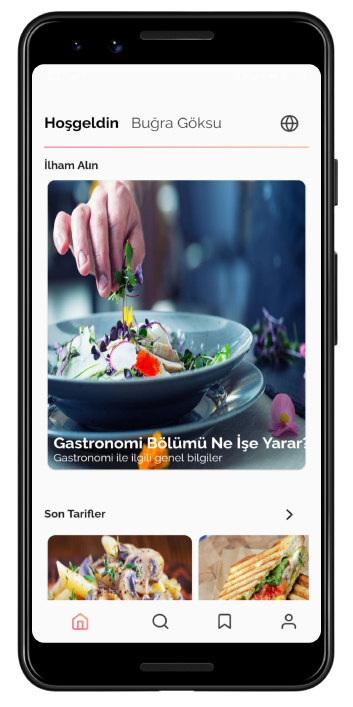
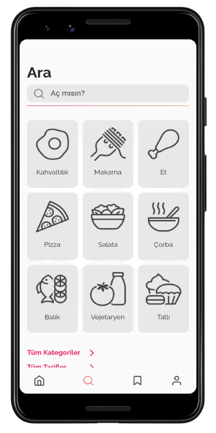
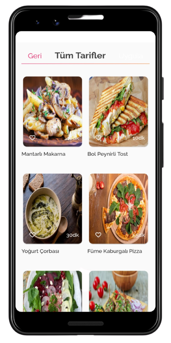
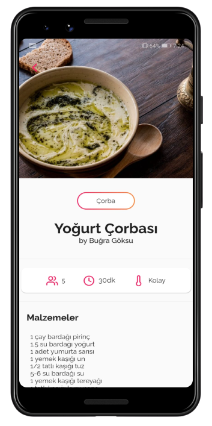
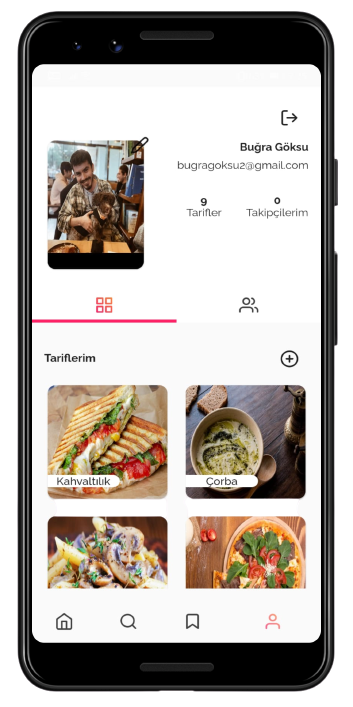

# bitarif

bitarif is a recipe application made with Flutter
# Download 

## Screenshots
<table>
    <tr>
        <td></td>
        <td></td>
        <td></td>
    </tr>
      <tr>
        <td></td>
        <td></td>
        <td></td>
    </tr>
</table>

## 🤓 Author
**Buğra Göksu** 